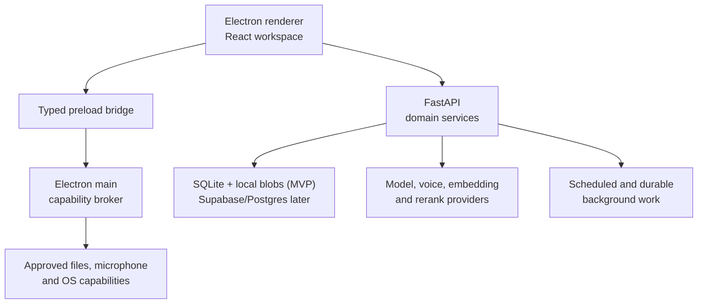
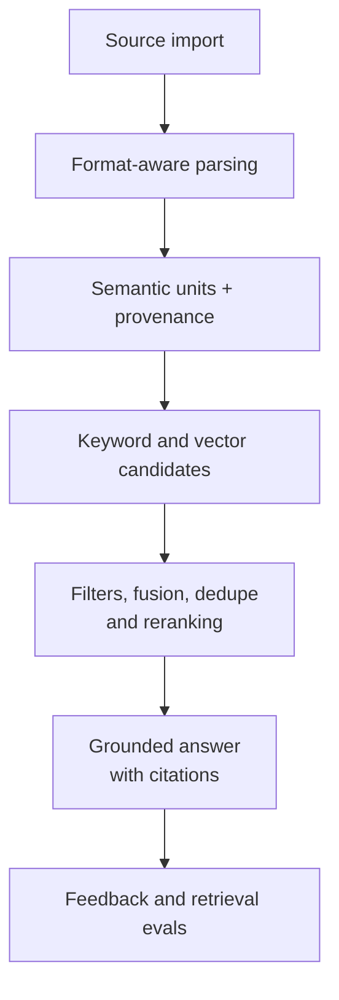
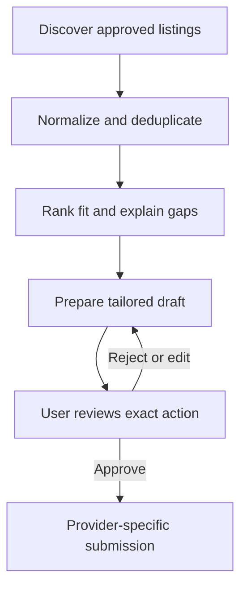

# Vikram architecture

## System shape

Vikram uses a web-technology desktop shell for the interaction layer and a Python service for document, retrieval, and engineering-tool integrations. A narrow capability broker separates untrusted rendered content and model output from the operating system.

The renderer owns presentation and ephemeral UI state. The main process owns native windows, explicit file pickers, microphone permission, safe external links, and purpose-specific OS capabilities. FastAPI owns projects, tasks, learning observations, ingestion, retrieval, model tools, and job workflows. The first local-only slice stores records in migrated SQLite and raw imported bytes in a content-addressed blob directory. Repository interfaces keep a later Supabase/Postgres shared system of record possible without making the renderer a database client; provider adapters keep the product independent of one AI or voice vendor.

The MVP API binds to `127.0.0.1`, permits only configured renderer origins, and requires a high-entropy capability header on every versioned route. The launcher generates that capability per run and shares it only with the API and exact allowlisted Electron renderer; CORS remains defense in depth, not authorization. Shared workspaces and packaged distribution require authenticated sessions, Supabase/Postgres migrations, and RLS before private multi-user data is placed there.

## Core modules

| Module | Owns | Must not own |
| --- | --- | --- |
| Desktop renderer | Views, input, optimistic UI, accessible interaction state | Secrets, raw Node APIs, direct storage/provider calls |
| Electron main | Window lifecycle, safe preload bridge, file picker, local process supervision, permission prompts | Product business rules or arbitrary remote shell |
| API | Domain rules, authorization, typed contracts, ingestion, retrieval, task/focus/job state | Renderer state or vendor-specific decisions in domain code |
| Worker | Scheduled discovery, parsing, indexing, evaluation, retryable workflows | Unapproved sends or submissions |
| SQLite/local blobs (MVP) | Single-user migrated records and immutable source bytes | Shared authorization, renderer access, or cloud synchronization |
| Supabase/Postgres (later) | Auth, project membership, durable shared records, storage, realtime, vector and full-text indexes | Hidden authorization in client code |
| Provider adapters | Nebius/model, embeddings, reranker, ElevenLabs/voice, optional local models | Cross-domain workflow state |

## Source-grounded engineering assistant

The article supplied with the project is right about the central failure mode: “embed everything and return top-k” is not enough. Vikram should implement retrieval as observable stages that can be evaluated separately.

### Ingestion adapters

- Papers and documents: begin with PDF and Markdown. Preserve page, heading, table, figure, and bounding-box metadata where extraction allows it.
- Code: add tree-sitter-based symbol units later. Preserve repository, commit, path, language, symbol, and line range.
- PCB: initially ingest a bundle of schematic/layout renders, BOM, netlist, DRC output, and design notes. Native Altium or KiCad manipulation is not an MVP requirement.
- CAD: initially ingest STEP metadata, drawings/renders, BOM, and notes. Direct native CAD editing remains behind a later format-specific adapter.

### Retrieval contract

1. Classify the question and select allowed projects, source types, dates, and artifact regions.
2. Generate keyword and semantic candidates.
3. Fuse ranked lists, remove near duplicates, and rerank a bounded candidate set.
4. Answer only from accepted evidence or clearly label model inference.
5. Return citations as structured records, not prose-only footnotes.
6. Log retrieval identifiers, ranking scores, latency, and user feedback without logging private source text unnecessarily.
7. Evaluate retrieval recall separately from answer groundedness.

Long context is a fallback resource, not a replacement for ingestion quality or retrieval evaluation.

The deterministic fake-provider baseline remains the default and uses token overlap plus hash embeddings over the small local evidence set. An optional project-scoped Nebius path caches float32 Qwen embeddings in SQLite, builds separate lexical and semantic ranks, fuses them with reciprocal-rank fusion, generates structured claims over at most four bounded evidence excerpts, and sends those claims through a separate verification request. The UI receives only verifier-approved claims; a fully unsupported result is not persisted. Provider calls are async, cancelable, bounded by total deadlines, classified on failure, and never receive data until the project policy records explicit ZDR attestation. PostgreSQL full-text search, pgvector, reranking, and durable background indexing remain follow-up work.

## Memory model

“Memory” is not one table and generated summaries are not authoritative facts.

| Memory class | Example | Retention and authority |
| --- | --- | --- |
| Source evidence | PDF page, code symbol, BOM row | Durable, immutable versioned evidence |
| Project fact | “ADC sample rate is 20 MSPS” | Durable claim with source or user confirmation |
| Learning observation | “Requested a first-principles explanation of phase margin” | Editable, confidence-scored, revisited over time |
| User preference | Preferred focus block or explanation depth | User-controlled durable setting |
| Session state | Current chat and retrieved candidates | Short-lived unless intentionally saved |
| Activity event | Task started, focus paused, explanation rated | Append-only audit/event record |
| Generated synthesis | Summary, plan, application draft | Versioned derivative; never silently replaces evidence |

Daily planning should use explicit constraints—deadlines, estimated effort, energy preference, calendars, incomplete tasks, and past focus outcomes—and show the user why a task was scheduled. Do not turn historical activity into an opaque productivity score.

## Job workflow and approval gate

Discovery, ranking, and drafting may be scheduled. Submission is a separate capability with an immutable audit event and a user approval bound to the listing, employer, documents, answers, and destination.

## OS and connector boundary

Use connectors or OAuth APIs for email, calendars, and cloud files when available. Use a local purpose-specific capability service for local files and desktop actions. MCP can expose these capabilities to the agent, but MCP is a tool protocol—not a permission model.

Never expose a generic `run_command`, unrestricted filesystem path, or raw Electron IPC channel to model-generated arguments. Define operations such as `choose_project_files`, `read_approved_file`, `open_safe_url`, or `draft_email`. Validate arguments, check current grants, show confirmation for side effects, execute, and append an audit event.

The implemented source-import capability is narrower still: the renderer invokes `chooseAndImport(projectId)`, Electron main opens a one-file `.pdf`/`.md` picker, validates the selected file and 10 MB bound, and uploads its bytes to the loopback API. Neither the renderer nor API receives the original absolute path. The preload bridge is frozen and versioned; it exposes only the validated loopback connection capability, source import, and a five-second audio-only permission window after a visible push-to-talk action.

## Observability and evaluation

Use structured traces across desktop request, API operation, retrieval stages, provider calls, and background jobs. Redact secrets and private content by default. Maintain small golden evaluation sets for engineering questions, citations, job deduplication, and approval gates before changing models, embeddings, chunking, or rerankers.
